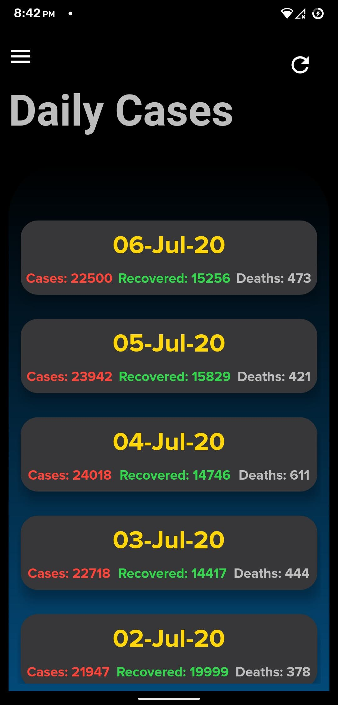
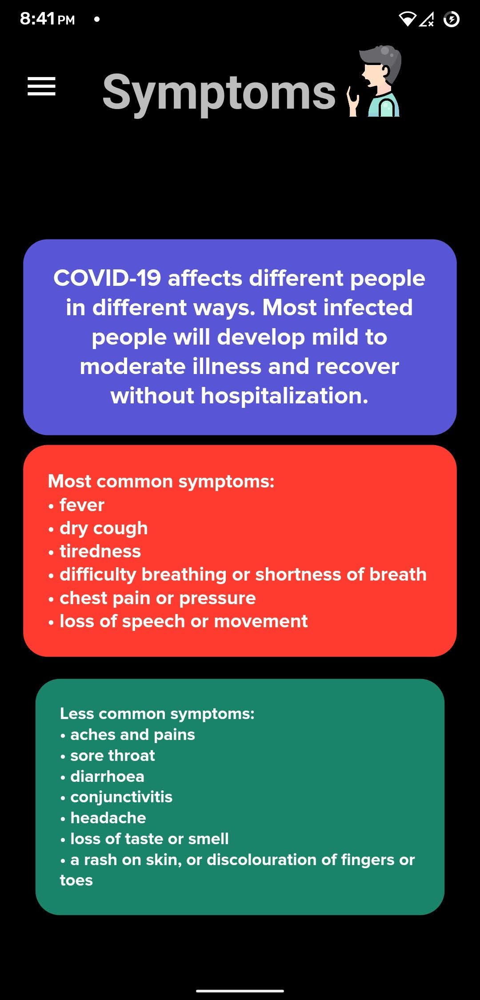
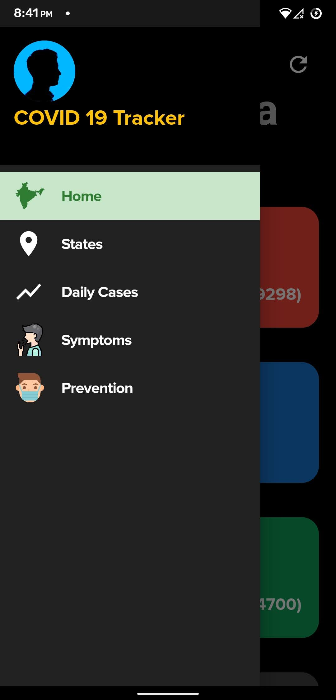

# covidTest

Flutter app to track COVID-19 statistics.<br>
Also, <a href="https://covid-live-track.herokuapp.com/">Click here</a> visit the website.

# Instructions

<a href="https://drive.google.com/drive/folders/15IG_GJ7sOA3DTGj94jqhcLvSIRVnqEuu?usp=sharing">Click Here</a> to download the apk.

Or else,<br>

Clone this repo.<br>
Plugin your phone and follow the below instructions:<br>
In the directory run these commands,<br>
```
flutter pub get
flutter build apk --split-per-abi
flutter install
```

# Screenshots

### Live Statistics of Cases in India

### SplashScreen

<p align="center">
<!--  -->
</p>

<p align="center">
<!--  -->
</p>

### Live Statistics of States in India

<p align="center">
<!--  -->
</p>

### Daily Statistics

<p align="center">
<!--  -->
</p>

### Symptoms of COVID-19

<p align="center">
<!--  -->
</p>

### Prevention of COVID-19

<p align="center">
<!--  -->
</p>

### App Drawer for Navigation through Pages

<p align="center">
<!--  -->
</p>
